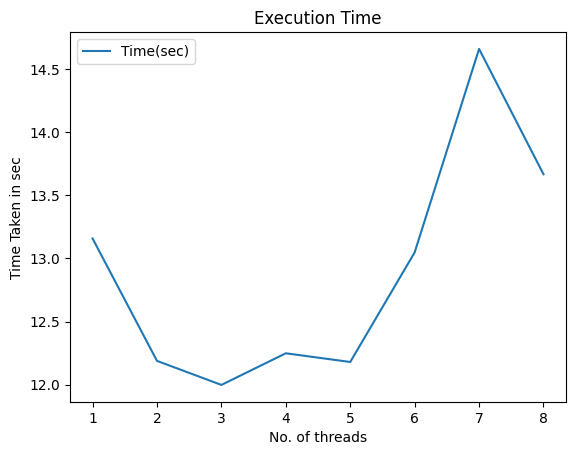

# Multi-Threading
## Submitted by:
- Name - Raghav Garg
- Roll number - 102103283
- Group - 3COE10

## What is multi threading

## Objective
The objective of this code is to demonstrate multi-threaded matrix multiplication in Python using numpy and threading libraries. The goal is to compare the performance of matrix multiplication using different numbers of threads.

## Methodology
- ### Generate Matrices
The generate_matrices function generates a list of random matrices based on the specified number of matrices (num_matrices) and the size of each matrix (size).

- ### Matrix Multiplication
The matrix_multiply function performs matrix multiplication using a constant matrix and a list of input matrices. It uses numpy's dot function for matrix multiplication.

- ### Multi-threaded Matrix Multiplication
The matrix_multiplication_using_threads function performs matrix multiplication using multiple threads. It divides the list of matrices into chunks based on the number of threads and assigns each chunk to a separate thread for parallel processing.

- ### Performance Measurement
The code measures the time taken for matrix multiplication using different numbers of threads (num_threads) and records the results in a dictionary.

- ### Results Display
The code prints the time taken by each number of threads for matrix multiplication and stores the results in a dictionary (results).
Usage
Install the required libraries using pip install numpy pandas matplotlib.
Run the code to perform multi-threaded matrix multiplication and compare the performance for different numbers of threads.

## Graphs
